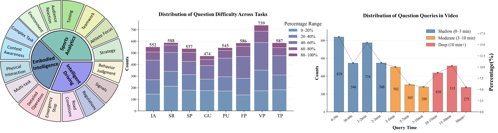
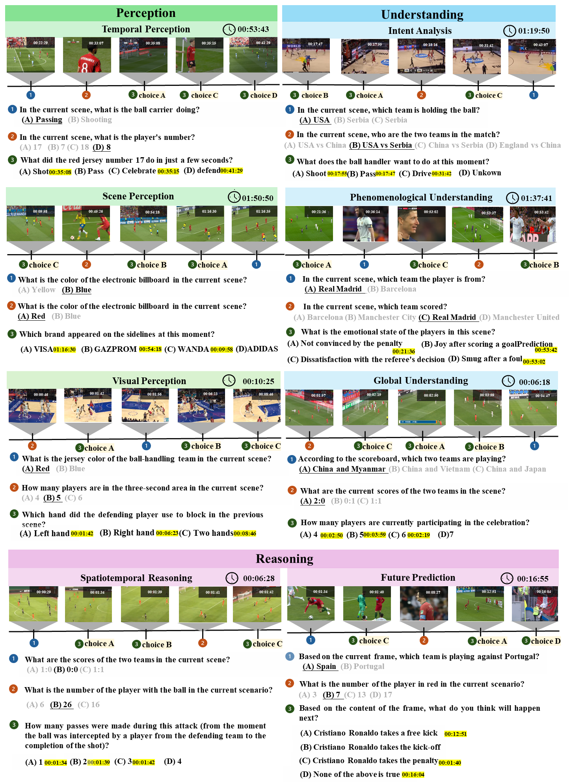

<div align="center">
  <h1>$\mathcal{RTV}\text{-}Bench$: Benchmarking MLLM Continuous Perception, Understanding and Reasoning through Real-Time Video</h1> 
</div>

[](https://huggingface.co/datasets/xunsh/RTV-Bench) [](https://www.modelscope.cn/datasets/Jungang/RTV-Bench)  


## 🔥 News
* **`2025.05.03`** 🌟 We are happy to release the $\mathcal{RTV}\text{-}Bench$. You can find the $\mathcal{RTV}\text{-}Bench$ from [](https://huggingface.co/datasets/xunsh/RTV-Bench) or [](https://www.modelscope.cn/datasets/Jungang/RTV-Bench).

## TODO
- [ ] Release the final label json.
- [ ] Release the evaluation code.
- [ ] Construct a more comprehensive benchmark for real-time video analysis.
- [ ] ···
## 👀 $\mathcal{RTV}\text{-}Bench$ Overview

We introduce $\mathcal{RTV}\text{-}Bench$, a fine-grained benchmark for MLLM real-time video analysis, which contains **552** videos (167.2 hours) and **4,631** high-quality QA pairs. We evaluated leading MLLMs, including proprietary (GPT-4o, Gemini 2.0), open-source offline (Qwen2.5-VL, VideoLLaMA3), and open-source real-time (VITA-1.5, InternLM-XComposer2.5-OmniLive) models. Experiment results show open-source real-time models largely outperform offline ones but still trail top proprietary models. Our analysis also reveals that larger model size or higher frame sampling rates do not significantly boost $\mathcal{RTV}\text{-}Bench$ performance, sometimes causing slight decreases. This underscores the need for better model architectures optimized for video stream processing and long sequences to advance real-time video analysis with MLLMs.  $\mathcal{RTV}\text{-}Bench$ includes three key principles: 
* **Multi-Timestamp Question Answering (MTQA)**, where answers evolve with scene changes; 
* **Hierarchical Question Structure**, combining basic and advanced queries; and
* **Multi-dimensional Evaluation**, assessing the ability of continuous perception, understanding, and reasoning. 

**Video Categories and Distribution of Question Difficulty and Query Characteristics.** 
<p align="center">
    
    (Left) RTV-Bench overs 3 key domains and 16 sub-class video types. 
    (Center) Distribution of question difficulty levels across eight representative task types, measured by percentage-based performance ranges.
    (Right) Distribution of question queries by video length, categorized into Shallow, Moderate, and Deep levels. The bar heights indicate counts, while the line chart overlays query proportions for each duration bucket.
</p>

## 📖Examples
<p align="center">
    
</p>

## 🔖Evaluation Results
<p align="center">
    
</p>

## 🌟 Star History

[](https://star-history.com/#LJungang/RTV-Bench&Date)

## :black_nib: Citation

If you find our work helpful for your research, please consider citing our work.   

```bibtex

}
```
