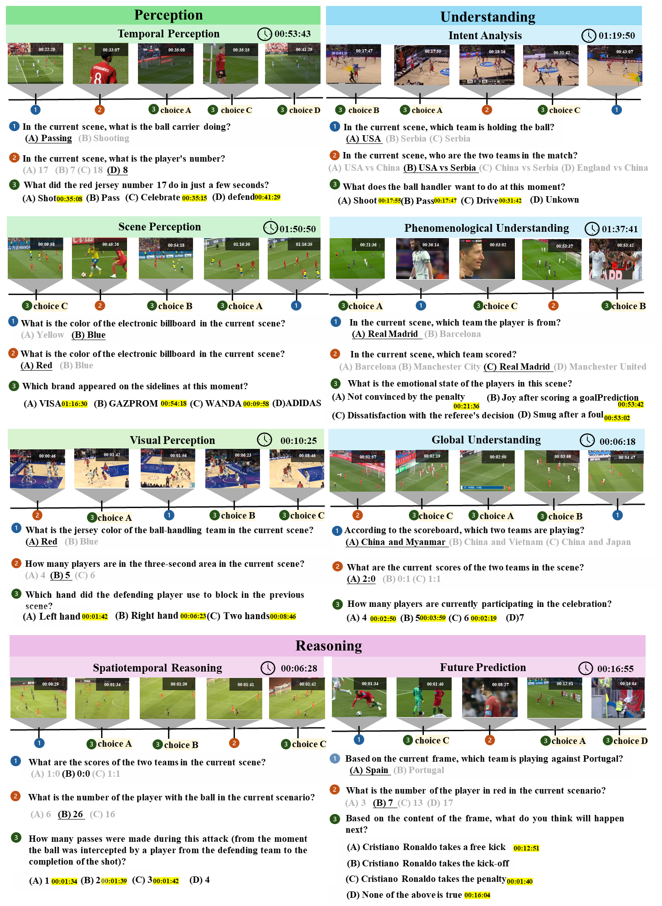
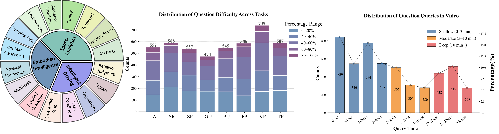
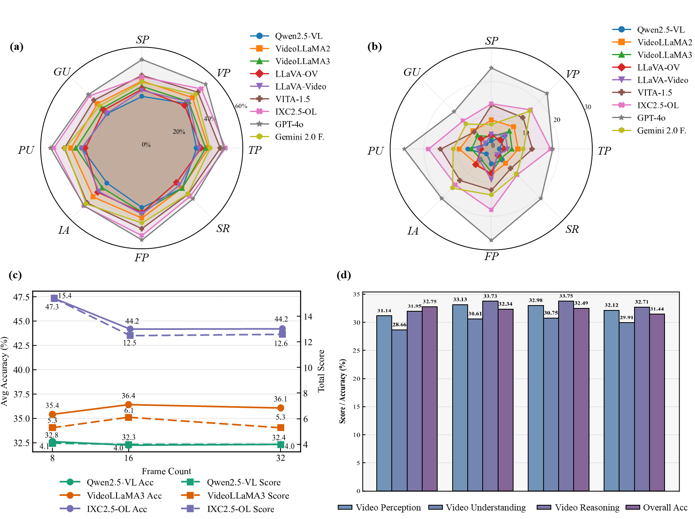

<div align="center">
  <h1>$\mathcal{RTV}\text{-}Bench$: Benchmarking MLLM Continuous Perception, Understanding and Reasoning through Real-Time Video</h1>
</div>
<p align="center">
  Shuhang Xun<sup>1*</sup>,
  <a href="https://scholar.google.com/citations?user=f1J2jZkAAAAJ">Sicheng Tao</a><sup>2*</sup>,
  <a href="https://github.com/LJungang">Jungang Li</a><sup>2,3*†</sup>,
  Yibo Shi<sup>4</sup>,
  <a href="https://scholar.google.com/citations?user=c51a_HwAAAAJ">Zhixin Lin</a><sup>5</sup>,
  Zhanhui Zhu<sup>1</sup>,
  <a href="https://scholar.google.com/citations?user=26yPSEcAAAAJ">Yibo Yan</a><sup>2,3</sup>,
  <a href="https://kyrie-li11.github.io/">Hanqian Li</a><sup>2</sup>,
  Linghao Zhang<sup>5</sup>,
  Shikang Wang<sup>6</sup>,
  Yixin Liu<sup>1</sup>,
  Hanbo Zhang<sup>7</sup>,
  Ying Ma<sup>1‡</sup>,
  <a href="https://scholar.google.com/citations?user=dbBKbXoAAAAJ">Xuming Hu</a><sup>2,3</sup>
</p>

<p align="center">
  <sup>1</sup>HIT&nbsp;&nbsp;
  <sup>2</sup>HKUST(GZ)&nbsp;&nbsp;
  <sup>3</sup>HKUST&nbsp;&nbsp;
  <sup>4</sup>XJTU&nbsp;&nbsp;
  <sup>5</sup>SDU&nbsp;&nbsp;
  <sup>6</sup>CityU&nbsp;&nbsp;
  <sup>7</sup>HUST
</p>

<p align="center">
  <em>* Equal Contribution</em>&nbsp;&nbsp;
  <em>† Project Leader</em>&nbsp;&nbsp;
  <em>‡ Corresponding Author</em>
</p>


<div align="center">
  <p align="center">
    &nbsp&nbsp📑 <a href="https://arxiv.org/abs/2505.02064"><b>Paper</b></a>&nbsp&nbsp | &nbsp&nbsp🏠 <a href="https://ljungang.github.io/RTV-Bench/"><b>Project Page</b></a>&nbsp&nbsp | 🤗 <a href="https://huggingface.co/datasets/xunsh/RTV-Bench"><b>Hugging Face</b></a>&nbsp&nbsp | 🤖 <a href="https://www.modelscope.cn/datasets/Jungang/RTV-Bench"><b>Model Scope</b></a>&nbsp&nbsp
</p>
<p align="center">
  If our project helps you, please give us a star ⭐ on GitHub to support us.
  <br>
  
</p>
</div>


## 🔥 News

- **`2025-12-27`** 📚 We released an [open-source survey repo](https://github.com/LJungang/Awesome-Video-Reasoning-Landscape) on the landscape of `video reasoning`, covering CoT-based, CoF-based, Interleaved, and Streaming paradigms.  
* **`2025-09-20`** 🎉 Our paper has been accepted by NeurIPS 2025, we will update our dataset and code for community as soon as possible~
* **`2025-06-27`** 🎉 We update core code for evaluation.
* **`2025-05-17`** 🎉 We have released the label json, which is named `QA.json`.
* **`2025-05-04`** 🎉  We released the paper $\mathcal{RTV}\text{-}Bench$: [Benchmarking MLLM Continuous Perception, Understanding and Reasoning through Real-Time Video](https://arxiv.org/abs/2505.02064).
* **`2025-05-03`** 🌟 We are happy to release the $\mathcal{RTV}\text{-}Bench$. You can find the $\mathcal{RTV}\text{-}Bench$ from [](https://huggingface.co/datasets/xunsh/RTV-Bench) or [](https://www.modelscope.cn/datasets/Jungang/RTV-Bench).
---
## 🔎 Overview

**RTV-Bench** is a fine-grained benchmark for **online/streaming video reasoning with Multimodal Large Language Models (MLLMs)**.  
It targets continuous perception, understanding, and reasoning over long, streaming videos.

RTV-Bench is built around three core ideas:
- **Multi-Timestamp Question Answering (MTQA)**: answers evolve as video content changes over time.
- **Hierarchical Question Design**: from basic perception to advanced reasoning.
- **Multi-Dimensional Evaluation**: assessing continuous perception, understanding, and reasoning jointly.

The benchmark contains **552 videos** and **4,631 high-quality QA pairs**, covering diverse real-world scenarios.

<p align="center">
  
</p>


**Video Categories and Distribution of Question Difficulty and Query Characteristics.** <p align="center">  (Left) RTV-Bench overs 3 key domains and 16 sub-class video types. (Center) Distribution of question difficulty levels across eight representative task types, measured by percentage-based performance ranges. (Right) Distribution of question queries by video length, categorized into Shallow, Moderate, and Deep levels. The bar heights indicate counts, while the line chart overlays query proportions for each duration bucket. </p>

---

## 🔖 Evaluation Results

<p align="center">
  
</p>

---
## 🛠️Evaluation 
```shell
bash scripts/eval/eval_model.sh
```


## 📑 Citation
If you find $\mathcal{RTV}\text{-}Bench$ useful for your research and applications, please cite using this BibTeX:
```bibtex
@article{xun2025rtv,
  title={RTV-Bench: Benchmarking MLLM Continuous Perception, Understanding and Reasoning through Real-Time Video},
  author={Xun, Shuhang and Tao, Sicheng and Li, Jungang and Shi, Yibo and Lin, Zhixin and Zhu, Zhanhui and Yan, Yibo and Li, Hanqian and Zhang, Linghao and Wang, Shikang and others},
  journal={arXiv preprint arXiv:2505.02064},
  year={2025}
}
```
